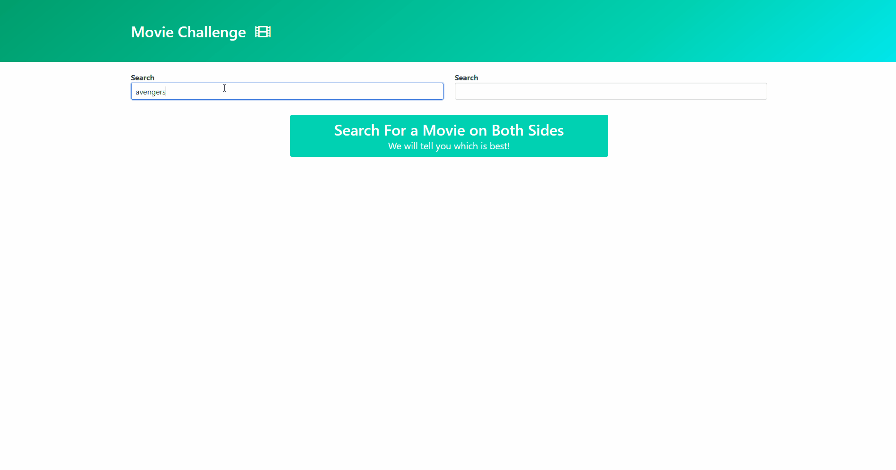

# movie-challenge 
App to fetch and compare movies details - **Live Demo Link** https://moviechallenge.netlify.app

### Rationale for building the app: 
I was interested in implementing a debounce function and a follow up request using vanilla ES6 JavaScript.

### List of App's Functionality:
* Fetch data from external API
* Compare and parse data values
* Autocomplete widget
* Follow up request
* Debounce
* Reusability

### Instructions for Deploying the App Locally:
* Clone or download the repo
* Open in a text editor the folder
* Install LiveServer plugin in the editor
* Open with live server
* You will need to get and add your own apiKey
